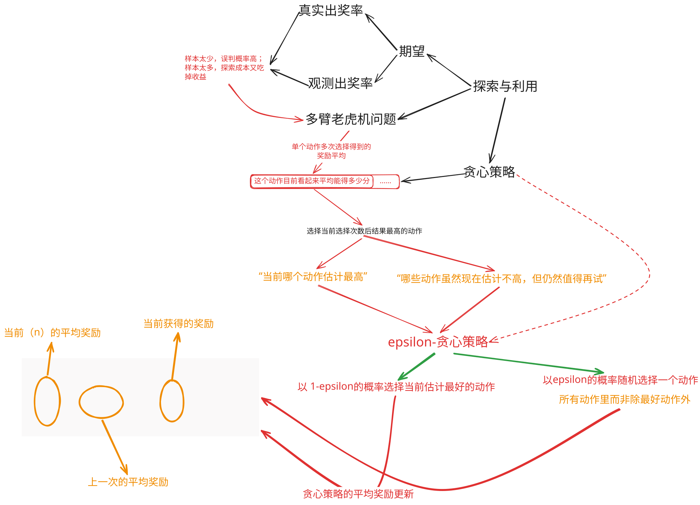
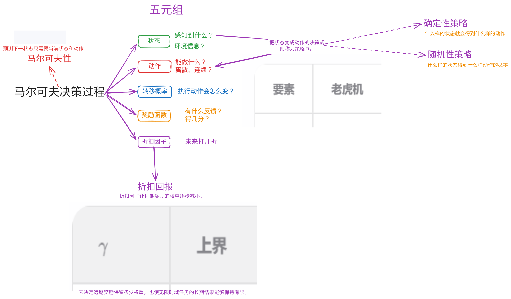
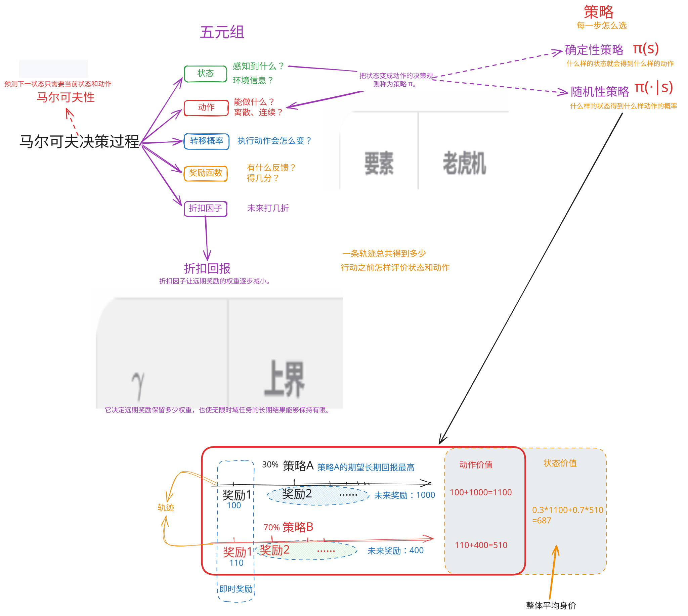

# 1. 动作与奖励 

**期望**

    每种结果的奖励乘以它出现的概率。

$$E[x]=\sum^{n}_{i=1} p_i * x_i$$
其中，$x_i$ 为第 $i$ 中结果的奖励，$p_i$ 为动作出现的概率。

**策略**

1. 均匀随机
2. 始终选A
3. 先试后定：前 20 轮交替尝试 A 和 B（各 10 次），记录各自的中奖比例；后 80 轮全部投给观测比例更高的一台。

**真实出奖率**和**观测出奖率**

探索的样本量直接决定回报：样本太少，误判概率高；样本太多，探索成本又吃掉收益。怎样分配探索机会是处理的问题。

# 2. 多老虎机问题

将两个老虎机推广至 $K$ 个机器，每个摇臂 $a\in\{1, 2, ..., K\}$ (即动作空间有 $K$ 个)， 且都对应着一个位置的奖励分布 $R_a$。

第 $t$ 轮智能体选择一个动作 $A_t$，且观测奖励：$R_t \sim R_{A_t}$。

每个摇臂的真实期望奖励为 $\mu_a=E[R_a]$

如果已经知道所有 $\mu_a$，最好的动作就是：$a^*=\argmax({\mu_a})$

# 3. MDP 与 马尔可夫性

# 4. 策略、价值与回报

    每一步怎么选（策略）
    一条轨迹总共得到多少
    行动之前怎么评价状态和动作

## 4.1 策略
- 确定策略
- 随机策略

按照每个策略依照步数运行，则生成一条轨迹。

平均长期回报最高的的为**最优策略**。
$$\pi^* = \argmax_{\pi}E_{\pi}[\sum_{t=0}\gamma^tR(s_t, a_t)]$$
表示在一定状态和动作下得到的回报的折扣后的奖励的总和的平均值中选最好的。

## 4.2 轨迹与回报

**轨迹**

$$r=(s_0,a_0,r_0; s_1, a_1, r_1; s_2, a_2, r_2, ..., s_i, a_i, r_i)$$

**回报**：
$$G_t=R_{t+1} + \gamma R_{t+2} + \gamma^2 R_{t+3} + ... = \sum_{k=0}\gamma^k R_{t+k+1}$$

从某个时刻开始的整段未来，需要把这些奖励合在一起。

## 4.3 价值函数与长期收益

同一个状态可能产生不同结果。如果重复次数足够多，这个平均值会逐渐接近该状态在当前策略下的期望回报。

**价值函数**衡量的就是这种“还没有真正走完时，对未来平均回报的估计”。

**状态价值**
已知当前状态 $s_t=s$ 之后按照策略 $\pi$ 行动时，回报 $G_t$ 的平均值。

$$V^{\pi}(s)=E_{\pi}[G_t|s_t=s]=E_{\pi}[\sum_{k=0} \gamma^k R_{t+k+1} | s_t=s]$$

**动作价值**

$$Q^{\pi}(s,a)=E_{\pi}[G_t| s_t=s, a_t=a]$$

$Q^{\pi}(s, a)$比$V^{\pi}(s)$ 多固定了第一步的动作。假设在同一个状态下，先向左推的多次平均回报是70，先向右退的多次平均回报是110。
这两个数据都假设第一步动作后继续按照原来策略行动。把状态整体上好不好细分为在这个状态下先做某个动作好不好。

$$V^{\pi}(s)=\sum_{a} \pi(a|s) Q^{\pi}(s,a)$$

## 4.4 优势函数与动作评价

**优势函数**
衡量动作相对于当前策略在状态下平均选择的动作好多少.

$$A^{pi}(s,a)=Q^{\pi}(s,a)-V^{pi}(s)$$

$A>0: 动作 a 比平均好$

$A<0: 动作 a 比平均差$

$A=0: 动作 a 是平均水平$

