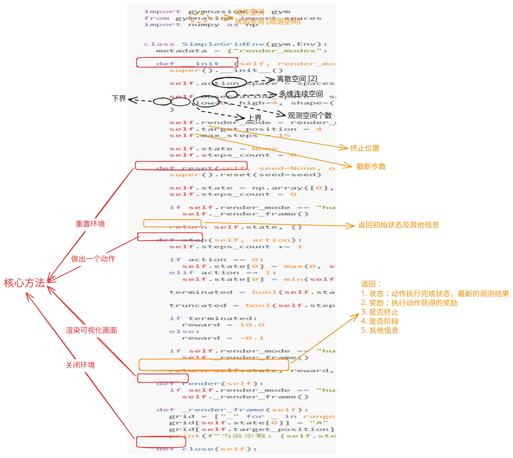
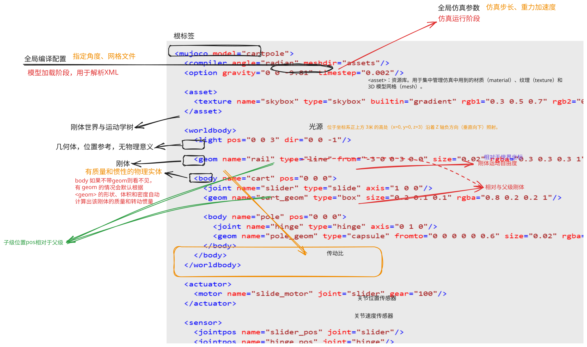

# Gymnasium 环境学习

```python

import gymnasium as gym
from gymnasium import spaces
import numpy as np


class SimpleGridEnv(gym.Env):
  metadata = {"render_modes": ["human"], "render_fps": 4}

  def __init__(self, render_mode=None):
    super().__init__()

    self.action_space = spaces.Discrete(2)

    self.observation_space = spaces.Box(
        low=0, high=4, shape=(1,), dtype=np.int32
    )

    self.render_mode = render_mode
    self.target_position = 4
    self.max_steps = 15

    self.state = None
    self.steps_count = 0

  def reset(self, seed=None, options=None):
    super().reset(seed=seed)

    self.state = np.array([0], dtype=np.int32)
    self.steps_count = 0

    if self.render_mode == "human":
      self._render_frame()

    return self.state, {}

  def step(self, action):
    self.steps_count += 1

    if action == 0:
      self.state[0] = max(0, self.state[0] - 1)
    elif action == 1: 
      self.state[0] = min(self.target_position, self.state[0] + 1)

    terminated = bool(self.state[0] == self.target_position)

    truncated = bool(self.steps_count >= self.max_steps)

    if terminated:
      reward = 10.0
    else:
      reward = -0.1

    if self.render_mode == "human":
      self._render_frame()

    return self.state, reward, terminated, truncated, {}

  def render(self):
    if self.render_mode == "human":
      self._render_frame()

  def _render_frame(self):
    grid = ["_" for _ in range(self.target_position + 1)]
    grid[self.state[0]] = "A"
    grid[self.target_position] = "T"
    print(f"当前步数: {self.steps_count:2d} | 画面: " + " ".join(grid))

  def close(self):
    pass
```



### 1. 必须定义的参数

**动作空间**：self.action_space

**观察/状态空间**：self.observation_space

**构造函数**：__init__(self, ...)

**重置环境**：reset(self, seed=None, options=None)

**动作执行**：step(self, action)


# MuJoCo 仿真环境
## XML文件

```xml
<mujoco model="cartpole">
  <compiler angle="radian" meshdir="assets"/>
  <option gravity="0 0 -9.81" timestep="0.002"/>

  <asset>
    <texture name="skybox" type="skybox" builtin="gradient" rgb1="0.3 0.5 0.7" rgb2="0 0 0" width="512" height="512"/>
  </asset>

  <worldbody>
    <light pos="0 0 3" dir="0 0 -1"/>
    
    <geom name="rail" type="line" from="-3 0 0 3 0 0" size="0.02" rgba="0.3 0.3 0.3 1"/>

    <body name="cart" pos="0 0 0">
      <joint name="slider" type="slide" axis="1 0 0"/>
      <geom name="cart_geom" type="box" size="0.2 0.1 0.1" rgba="0.8 0.2 0.2 1"/>
      
      <body name="pole" pos="0 0 0">
        <joint name="hinge" type="hinge" axis="0 1 0"/>
        <geom name="pole_geom" type="capsule" fromto="0 0 0 0 0 0.6" size="0.02" rgba="0.2 0.2 0.8 1"/>
      </body>
    </body>
  </worldbody>

  <actuator>
    <motor name="slide_motor" joint="slider" gear="100"/>
  </actuator>

  <sensor>
    <jointpos name="slider_pos" joint="slider"/>
    <jointpos name="hinge_pos" joint="hinge"/>
    <jointvel name="slider_vel" joint="slider"/>
    <jointvel name="hinge_vel" joint="hinge"/>
  </sensor>
</mujoco>
```



# Gymnasium 和 Mujoco 结合

```XML
<mujoco model="cartpole">
    <compiler angle="radian"/>
    <option timestep="0.01" gravity="0 0 -9.81"/>

    <default>
        <joint limited="true" damping="0.05"/>
        <geom density="1000"/>
    </default>

    <worldbody>
        <light pos="0 0 3" dir="0 0 -1"/>
        <geom name="rail" type="capsule" size="0.02" fromto="-2.5 0 0 2.5 0 0" rgba="0.8 0.8 0.8 0.5"/>

        <!-- 父级 Body：小车 -->
        <body name="cart" pos="0 0 0">
            <joint name="slider" type="slide" axis="1 0 0" range="-2.4 2.4"/>
            <geom name="cart_geom" type="box" size="0.2 0.1 0.1" rgba="0 0.8 0.8 1" mass="1.0"/>

            <!-- 子级 Body：摆杆（嵌套在 cart 内部） -->
            <body name="pole" pos="0 0 0">
                <joint name="hinge" type="hinge" axis="0 1 0" limited="false"/>
                <geom name="pole_geom" type="capsule" size="0.03" fromto="0 0 0 0 0 0.6" rgba="0.8 0.2 0.2 1" mass="0.1"/>
            </body>
        </body>
    </worldbody>
    
    <actuator>
        <motor joint="slider" name="slider_motor" gear="15" ctrlrange="-1 1"/>
    </actuator>
</mujoco>
```

```python
import numpy as np
import gymnasium as gym
from gymnasium import spaces
import mujoco
import mujoco.viewer
import time

class CartPoleEnv(gym.Env):
    metadata = {"render_modes": ["human"], "render_fps": 50}

    def __init__(self, xml_path, render_mode=None):
        super().__init__()
        self.xml_path = xml_path
        self.render_mode = render_mode

        # Load the MuJoCo model and create a simulation data object
        self.model = mujoco.MjModel.from_xml_path(self.xml_path)
        self.data = mujoco.MjData(self.model)

        self.action_space = spaces.Box(low=-1.0, high=1.0, shape=(1,), dtype=np.float32)

        high = np.array([2.5, np.pi, np.finfo(np.float32).max, np.finfo(np.float32).max], dtype=np.float32)
        self.observation_space = spaces.Box(-high, high, dtype=np.float32)

        self.viewer = None

    def _get_obs(self):
        return np.concatenate([
            self.data.qpos.flat,
            self.data.qvel.flat,
        ])

    def reset(self, seed=None, options=None):
        super().reset(seed=seed)
        mujoco.mj_resetData(self.model, self.data)

        self.data.qpos[0] = self.np_random.uniform(low=-0.05, high=0.05)
        self.data.qpos[1] = self.np_random.uniform(low=-0.05, high=0.05)
        mujoco.mj_forward(self.model, self.data)

        return self._get_obs(), {}

    def step(self, action):
        # Apply the action to the simulation
        self.data.ctrl[0] = action[0]

        mujoco.mj_step(self.model, self.data)

        obs = self._get_obs()
        cart_x, pole_theta, cat_vel, pole_vel = obs

        terminated = bool(
            abs(cart_x) > 2.4 or abs(pole_theta) > 0.20943951
        )
        reward = 1.0 if not terminated else 0.0

        return obs, reward, terminated, False, {}

    def render(self):
        if self.render_mode == "human":
            if self.viewer is None:
                self.viewer = mujoco.viewer.launch_passive(self.model, self.data)
            self.viewer.sync()
        else:
            raise NotImplementedError(f"Render mode {self.render_mode} not implemented.")

    def close(self):
        if self.viewer is not None:
            self.viewer.close()
            self.viewer = None
```

### 确认打印关节顺序
```python
# 遍历模型中的所有关节
for i in range(model.njnt):
    joint_name = mujoco.mj_id2name(model, mujoco.mjtObj.mjOBJ_JOINT, i)
    qpos_adr = model.jnt_qposadr[i]  # 该关节在 qpos 中的起始索引
    qvel_adr = model.jnt_dofadr[i]   # 该关节在 qvel 中的起始索引
    
    print(f"关节名称: {joint_name} | qpos索引: {qpos_adr} | qvel索引: {qvel_adr}")
```