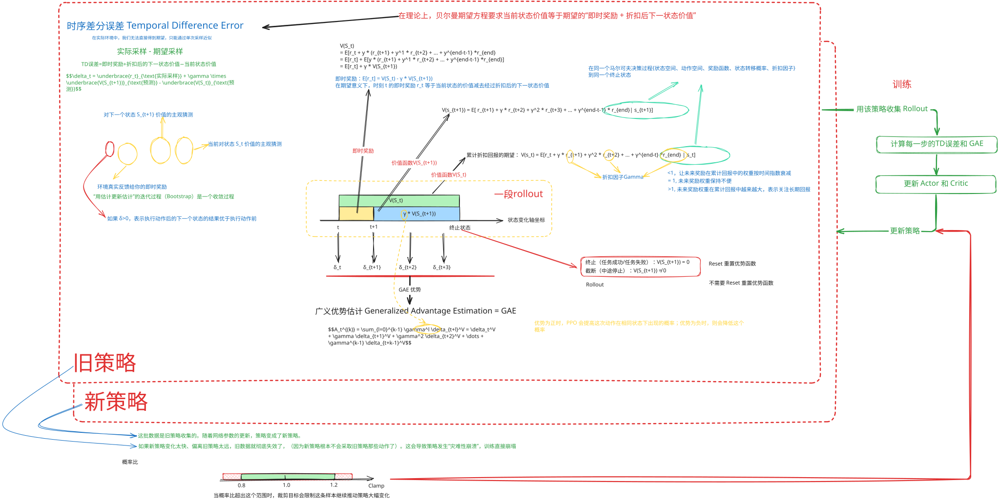

# **CartPole** 入门

## 概念理解
### 状态价值 State Value
$V(S_t)$ 表示在一定策略下当前状态$t$下到未来终止状态这个期间获得的价值（根据获取奖励计算的累计折扣回报的期望值）

$V(S_{t+1})$ 表示在一定策略下状态$t+1$下到未来终止状态这个期间获得的价值（根据获取奖励计算的累计折扣回报的期望值）

    表示的是从现在到未来的回报计算。

公式：

$V(s_t) = E[r_t+γ*r_{t+1}+γ^2*r_{t+2}+...+γ^{end-t}*r_{end}| s_t] $

$V(s_{t+1}) = E[r_{t+1} + γ * r_{t+2} + γ^2 * r_{t+3} + ... + γ^{end-t-1} * r_{end}| s_{t+1}]$

其中，$end$ 为终止时刻。$\gamma$为折扣因子。其中 $E[r_t]$ 为即时奖励，等于 $V(s_t)-\gamma*V(s_{t+1})$

### 时序差分误差 Temporal-difference Error [TD误差]

$$
\delta_t = \underbrace{r_t}_{\text{实际采样}} + \gamma \times \underbrace{V(S_{t+1})}_{\text{预测}} - \underbrace{V(S_t)}_{\text{预测}}
$$

$V(S_t)$ 为智能体当前对状态 $S_t$ 价值的主观猜测（由神经网络或Q表计算得出）。它完全是模型自己估算出来的，不是客观现实。

$r_t$ 智能体执行动作后，环境真实反馈给你的即时奖励（比如打游戏时屏幕上真正加了 10 分，或者机器人真实移动了一步）。这是客观发生的、外界给你的数值，不是猜的。

$V(S_{t+1})$ 智能体对下一个状态 $S_{t+1}$ 价值的主观猜测。和 $V(S_t)$ 一样，它依然是模型估算出来的。

- **当前预测 / 当前估计**：$V(S_t)$这是智能体目前对状态 $S_t$ 价值的主观猜想。算法的核心目的就是通过不断迭代来修正这个预测。
- **TD 目标 / 引导估计**：$r_t + \gamma V(S_{t+1})$这是由真实采样和未来估计拼凑出的一个“新参考标准”。其中 $r_t$ 是外界真实给的（实际采样），而 $V(S_{t+1})$ 依然是模型对下一个状态的估计。

TD 学习的本质，就是用这个包含“部分真实、部分估计”的 TD 目标 去纠偏当前的 预测 $V(S_t)$。两者相减产生的误差（$\delta_t = \text{Target} - \text{Prediction}$）就是推动模型不断进化的方向盘。

### 广义优势估计 Generalized Advantage Estimation (GAE)

$$
\hat{A} = \delta_t + \gamma * \lambda * \delta_{t+1} + (\gamma * \lambda)^2 * \delta_{t+2} + ...
$$

其中，$\gamma$ 为折扣因子， $\lambda$ 为 GAE 权重参数。

$k$ 步的总回报（k=2）:
$$
R_t^{(2)} = r_t + \gamma r_{t+1} + \gamma^2 V(S_{t+2})
$$

$k$ 步的优势函数（k=2）：
$$
A_t^{(2)} = \underbrace{r_t + \gamma r_{t+1} + \gamma^2 V(S_{t+2})}_{\text{2 步实际回报}} - \underbrace{V(S_t)}_{\text{初始预期}}
$$

$$
A_t^{(2)} = r_t + \mathbf{\gamma V(S_{t+1})} - V(S_t) + \gamma r_{t+1} + \gamma^2 V(S_{t+2}) - \mathbf{\gamma V(S_{t+1})}
$$

$$
A_t^{(2)} = \delta_t^V + \gamma \delta_{t+1}^V
$$

$$
A_t^{(k)} = \sum_{l=0}^{k-1} \gamma^l \delta_{t+l}^V = \delta_t^V + \gamma \delta_{t+1}^V + \gamma^2 \delta_{t+2}^V + \dots + \gamma^{k-1} \delta_{t+k-1}^V
$$

### 概率比 Probability Ratios

为了衡量新旧策略的差距，PPO 引入了概率比 $r_t(\theta)$：
$$
r_t(\theta) = \frac{\pi_\theta(a_t\vert{}s_t)}{\pi_{\theta_{old}}(a_t\vert{}s_t)}
$$

- 当 $r_t = 1$：新旧策略对这个动作的概率完全一样。
- 当 $r_t > 1$：说明这个动作在新策略中变得更常见了（新策略更倾向于选它）。
- 当 $r_t < 1$：说明这个动作在新策略中变得更少见了。

---

## 图示笔记

